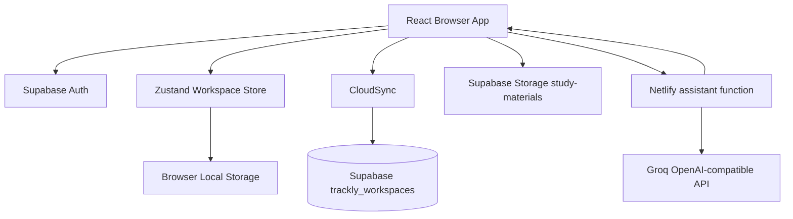
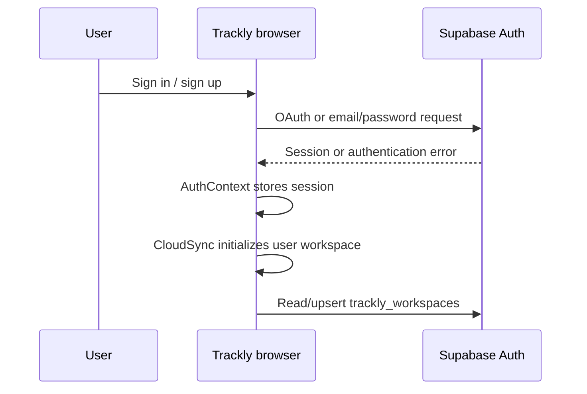
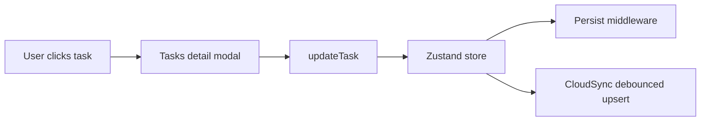
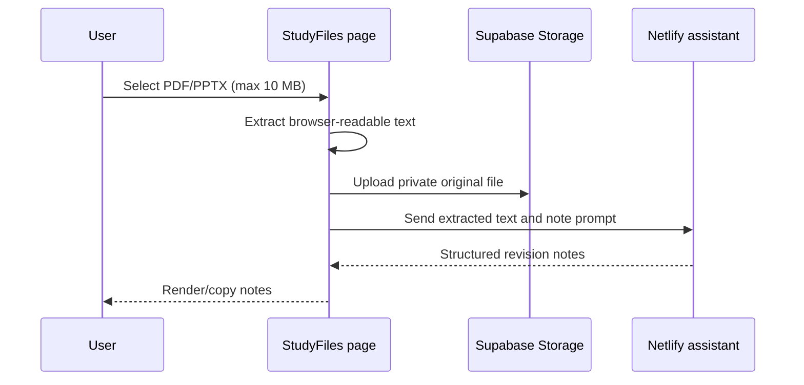
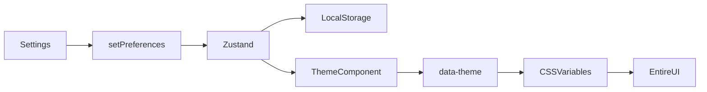

# Trackly — Complete Project Documentation

> **Plan • Track • Achieve**  
> Maintainer guide for developers, contributors, and deployment owners.  
> **Project version:** 1.0.0 · **Application type:** React single-page application (SPA)

---

## Table of Contents

1. [Project Overview](#1-project-overview)
2. [Technology Stack](#2-technology-stack)
3. [Folder Structure](#3-folder-structure)
4. [Architecture and Data Flow](#4-architecture-and-data-flow)
5. [Application Entry, Routing, and Layout](#5-application-entry-routing-and-layout)
6. [Pages and Components](#6-pages-and-components)
7. [State Management and Persistence](#7-state-management-and-persistence)
8. [Supabase Database, Storage, and Realtime](#8-supabase-database-storage-and-realtime)
9. [Authentication](#9-authentication)
10. [AI Features and Server Functions](#10-ai-features-and-server-functions)
11. [Themes and Styling](#11-themes-and-styling)
12. [Calendar, Tasks, Habits, Notes, Journal, and Study Files](#12-feature-documentation)
13. [Environment Variables](#13-environment-variables)
14. [Build, Local Development, and Deployment](#14-build-local-development-and-deployment)
15. [Security](#15-security)
16. [Performance](#16-performance)
17. [Customization Guide](#17-customization-guide)
18. [Future Improvements](#18-future-improvements)
19. [Developer Tips, FAQ, and Glossary](#19-developer-tips-faq-and-glossary)

---

## 1. Project Overview

### What is Trackly?

Trackly is a student productivity workspace. It brings together planning, tasks, habits, calendar scheduling, study notes, journaling, analytics, study-file uploads, and AI assistance in one responsive web application.

### Target users

- University, college, and high-school students
- Self-learners and online learners
- Exam-preparation students
- Any person who wants a lightweight personal academic planner

### Problems solved

| Problem | Trackly solution |
|---|---|
| Classes and deadlines are scattered across apps | Calendar/timetable and task workspace |
| Users forget what to do next | Overview cards, deadlines, live schedule, and priorities |
| Habits are difficult to maintain | Daily check-ins, saved history, and real streaks |
| Study material is hard to turn into revision notes | Private PDF/PPTX upload and AI note generation |
| Productivity tools feel generic | Persistent visual themes and contextual AI assistance |

### Product principles

1. **Calm over clutter.** A student should see the next useful action without a wall of metrics.
2. **User-owned data.** Insights are derived from a user’s own activity rather than fabricated sample charts.
3. **Local-first with cloud sync.** Zustand/Local Storage gives instant UI response; Supabase supports authenticated persistence.
4. **AI proposes; users approve.** AI should present a plan or action before changing tasks, habits, or calendar records.

---

## 2. Technology Stack

| Technology | Version/configuration | Purpose | Why used | Alternatives |
|---|---:|---|---|---|
| React | 19 | Component UI rendering | Mature component model and ecosystem | Vue, Svelte, Angular |
| TypeScript | ~5.7 | Static typing | Safer refactoring and typed models | JavaScript |
| Vite | ^6.1 | Dev server and production bundler | Fast development and optimized output | Next.js, Parcel, Webpack |
| Wouter | ^3.3 | SPA routing | Small routing library with protected-route support | React Router |
| Zustand | ^5.0 | Global client state | Minimal API and Local Storage middleware | Redux Toolkit, Jotai |
| Supabase JS | ^2.49 | Auth, Storage, database, Realtime | Managed Auth/Postgres/Storage with RLS | Firebase, Appwrite |
| Recharts | ^2.15 | Charts | React-friendly analytics charts | Nivo, Chart.js |
| Lucide React | ^0.468 | Icons | Consistent accessible SVG icon system | Heroicons, Phosphor |
| pdfjs-dist | ^5.6 | PDF text extraction | Reads text-based PDFs in the browser | Server OCR, PSPDFKit |
| JSZip | ^3.10 | PPTX extraction | Reads XML inside `.pptx` archives | Server-side LibreOffice conversion |
| Netlify Functions | Platform feature | Server-only AI/email endpoints | Keeps private keys out of browser code | Supabase Edge Functions, Express host |
| Tailwind CSS | ^3.4, installed | Utility CSS availability | Available for future incremental use | CSS modules |
| PostCSS/Autoprefixer | ^8.5/^10.4 | CSS processing | Tailwind/PostCSS compatibility | None for current handwritten CSS |
| `@vitejs/plugin-react` | ^4.4 | React transform | Vite React support | SWC React plugin |
| Node types / React types | Dev dependencies | Type declarations | TypeScript compilation | N/A |

### Technologies **not currently used as runtime architecture**

- **Express.js:** not present in `package.json`; Netlify Functions are used instead.
- **shadcn/ui / Radix UI:** not installed in this snapshot. The project uses project-owned components such as `Modal`.
- **Framer Motion:** not installed. Motion is implemented with CSS transitions and keyframes.
- **ESLint / Prettier:** not configured as scripts in the current `package.json`. Add them before team-scale development.

---

## 3. Folder Structure

```text
trackly/
├── src/
│   ├── assets/                  # Brand logo image
│   ├── components/
│   │   ├── shared/              # Icons, contextual AI, error boundary
│   │   ├── timetable/           # Timetable-specific AI/live schedule components
│   │   └── ui/                  # Modal and confirmation UI primitives
│   ├── contexts/                # Auth and cloud synchronization providers
│   ├── layouts/                 # Authenticated shell and shared Page component
│   ├── pages/                   # Route-level screens
│   ├── services/                # Supabase client and AI HTTP helper
│   ├── stores/                  # Zustand workspace state
│   ├── styles/                  # Global CSS, themes, responsive rules
│   ├── themes/                  # Central theme configuration
│   ├── types/                   # Shared domain TypeScript types
│   ├── utils/                   # Local-date and quote utilities
│   ├── App.tsx                  # Route composition/providers
│   └── main.tsx                 # React bootstrap
├── public/
│   ├── _redirects               # Netlify SPA fallback
│   └── favicon.png              # Browser tab icon
├── netlify/functions/
│   ├── assistant.mjs            # Private AI proxy/function
│   └── welcome.mjs              # Optional Resend welcome email function
├── supabase/schema.sql          # Database/profile/workspace SQL
├── package.json                 # Scripts and dependencies
├── vite.config.ts               # Vite configuration
├── netlify.toml                 # Netlify build/function/redirect configuration
├── tsconfig*.json               # TypeScript configuration layers
├── index.html                   # Vite HTML entry and favicon reference
├── .env.example                 # Variable-name reference only; never use for real keys
└── PROJECT_DOCUMENTATION.md     # This document
```

### AI-assistant skill directories

The repository may contain `.agents`, `.claude`, `.cursor`, `.codex`, `.windsurf`, `.augment`, `.gemini`, `.github`, `.kiro`, `.continue`, `.roo`, `.qoder`, `.trae`, `.warp`, and related folders. These are generated/installed **AI coding-assistant skill packs**. They contain prompt instructions, CSV catalogs, scripts, templates, tests, and reference documents. They do **not** run in Trackly’s browser bundle and are not application runtime source.

- Safe to remove if the team does not use those AI coding tools.
- Do not edit their generated data casually; re-run the skill installer instead.
- Keep them out of production build logic.

---

## 4. Architecture and Data Flow



### Key design decisions

- Route pages compose smaller reusable components.
- The Zustand store is the immediate source for tasks, habits, timetable, and preferences.
- `CloudSync` mirrors that state to a single JSON workspace row for an authenticated user.
- Notes and Journal currently use page-level Local Storage keys in this snapshot; they are extension points for cloud migration.
- The browser never receives `AI_API_KEY` or `RESEND_API_KEY`.

### Authentication flow



---

## 5. Application Entry, Routing, and Layout

### `src/main.tsx`

**Purpose:** Browser bootstrap file. It imports global styles and renders `App` into `#root`.

- **Loads:** once, when Vite’s `index.html` runs.
- **Safe to edit:** rarely; add top-level providers here only when needed.
- **Do not remove:** `createRoot(...).render(...)`; the application will not render.

### `src/App.tsx`

**Purpose:** Declares public and protected routes and mounts global providers.

| Route | Page | Access |
|---|---|---|
| `/` | Landing | Public |
| `/sign-in` | AuthPage sign-in mode | Public |
| `/sign-up` | AuthPage sign-up mode | Public |
| `/reset-password` | ResetPassword | Public/recovery session |
| `/app` | Dashboard | Protected when Supabase configured |
| `/timetable` | Timetable | Protected |
| `/tasks` | Tasks | Protected |
| `/habits` | Habits | Protected |
| `/analytics` | Analytics | Protected |
| `/notes` | Notes | Protected |
| `/journal` | Journal | Protected |
| `/study-files` | StudyFiles | Protected |
| `/assistant` | Assistant | Protected |
| `/settings` | Settings | Protected |

`Workspace` waits for Auth restoration. If Supabase is configured but no session exists, it redirects to `/sign-in`.

**Safe customization:** add routes and protected pages.  
**Critical behavior:** preserve `AuthProvider`, `Theme`, and `CloudSync` mounting.

### `src/layouts/AppLayout.tsx`

**Purpose:** Persistent authenticated sidebar, mobile navigation, user menu, and reusable `Page` header wrapper.

- Imports the logo and section icons.
- `nav` is the authoritative navigation list.
- `Page` supplies a consistent title, eyebrow text, action area, and page spacing.
- Edit the `nav` array to add/reorder pages.
- Deleting `AppLayout` removes authenticated navigation.

---

## 6. Pages and Components

### Route pages

| File | Responsibility | Main state/dependencies | Safe customization |
|---|---|---|---|
| `Landing.tsx` | Product marketing page | Wouter links, logo | Copy, sections, screenshots, CTA text |
| `Auth.tsx` | Email/Google sign-in and registration | `AuthContext`, local form state | Labels, validation text, onboarding fields |
| `ResetPassword.tsx` | Password recovery/update | `AuthContext` | Recovery copy and password policy |
| `Dashboard.tsx` | Daily overview | Zustand tasks/habits/schedule, live schedule | Cards, summaries, contextual actions |
| `Timetable.tsx` | Calendar views and event creation/editing | Zustand schedule/tasks, `AISchedule` | Calendar views, event forms, colors |
| `Tasks.tsx` | Search, complete, edit, delete tasks | Zustand task methods, `ConfirmDialog` | Task fields, filters, grouping |
| `Habits.tsx` | Suggestions, check-ins, heatmap, streaks | Zustand habits | Suggestions, colors, habit metadata |
| `Analytics.tsx` | Data-driven charts/empty state | Zustand tasks/habits/schedule | Metrics and chart definitions |
| `Notes.tsx` | Local note writing and simple tools | Local Storage | Add richer editor or cloud persistence |
| `Journal.tsx` | Local journal entries/theme selection | Local Storage | Prompts, moods, theme presets |
| `StudyFiles.tsx` | PDF/PPTX upload and AI note generation | Supabase Storage, PDF.js, JSZip, AI service | File limit, generated-note template |
| `Assistant.tsx` | Persistent AI workspace conversation | Zustand and Local Storage | Action schemas, prompts, history UX |
| `Settings.tsx` | Profile, theme, reminders, data actions | AuthContext/Zustand | Preferences and export behavior |

### Shared components

| File | What it does | Used by |
|---|---|---|
| `components/shared/Icons.tsx` | Re-exports selected Lucide icons from one location | Pages/layouts/components |
| `ContextualAI.tsx` | Section-scoped AI modal with starter prompt | Dashboard, tasks, habits, notes, journal |
| `AppErrorBoundary.tsx` | Catches rendering exceptions and shows recovery UI | `main.tsx` if mounted |
| `components/ui/Modal.tsx` | Accessible modal shell with overlay/close behavior | Forms and dialogs |
| `ConfirmDialog.tsx` | Project-styled destructive confirmation dialog | Task deletion |
| `components/timetable/AISchedule.tsx` | AI schedule proposal UI | Timetable |
| `RealtimeSchedule.tsx` | Device-time schedule summary | Dashboard |

### Example component flow: task edit



---

## 7. State Management and Persistence

### `src/stores/useTracklyStore.ts`

**Purpose:** Central Zustand store for workspace data.

Managed state:

```ts
tasks: Task[]
habits: Habit[]
schedule: ScheduleItem[]
preferences: Preferences
```

Primary actions:

```ts
addTask, updateTask, deleteTask
addHabit, toggleHabit, deleteHabit
addSchedule, updateSchedule, deleteSchedule
setPreferences
reset
hydrate
```

`persist(...)` saves a serializable subset under Local Storage key:

```text
trackly-workspace
```

**Safe:** add new serializable fields and matching actions.  
**Important:** When adding persisted fields, update `partialize`, `hydrate`, CloudSync payload, and types together.

### Local page storage

| Key | Owner | Content |
|---|---|---|
| `trackly-notes` | Notes page | Note list in current browser |
| `trackly-journal` | Journal page | Journal entries in current browser |
| `trackly-journal-theme` | Journal page | Selected journal-only theme |
| `trackly-ai-history` | Assistant page | Conversation history |
| `trackly-study-uploads-<user>-<date>` | StudyFiles | Daily upload counter |

These keys are browser-local. Clearing browser storage removes them. To sync Notes/Journal across devices, migrate them into the Zustand/Supabase workspace payload or normalized Supabase tables.

---

## 8. Supabase Database, Storage, and Realtime

### `supabase/schema.sql`

The SQL file creates:

| Table | Primary key | Purpose |
|---|---|---|
| `public.profiles` | `id` → `auth.users.id` | Profile name/role/avatar metadata |
| `public.trackly_workspaces` | `user_id` → `auth.users.id` | JSON payload for user workspace data |

`trackly_workspaces.payload` is JSONB. A typical payload is:

```json
{
  "tasks": [],
  "habits": [],
  "schedule": [],
  "preferences": {}
}
```

### Row Level Security

RLS must be enabled. Users must only be able to access a row where:

```sql
auth.uid() = user_id
```

Never replace this with a public `true` policy in production.

### Storage bucket: `study-materials`

Create a private Supabase Storage bucket:

```text
study-materials
```

StudyFiles uploads under:

```text
<authenticated-user-id>/<random-id>-<sanitized-file-name>
```

Storage policies must restrict the first folder name to `auth.uid()::text`.

### Realtime

`CloudSync` listens for updates to `trackly_workspaces`. Enable the table in the `supabase_realtime` publication if cross-device update events are required.

---

## 9. Authentication

### `src/contexts/AuthContext.tsx`

Provides:

```ts
user
loading
configured
signInWithGoogle()
signIn(email, password)
signUp(email, password, fullName, role)
sendPasswordReset(email)
updatePassword(password)
signOut()
updateProfile(fullName)
```

### Authentication rules

- Google-created users should use Google sign-in, not email/password unless they later set a password.
- Email signup can require email confirmation depending on Supabase **Confirm email** configuration.
- If Confirm email is disabled, Supabase returns a user session immediately.
- The app form must match Supabase password requirements. If Supabase requires 8 characters, uppercase, lowercase, and digit, update the client validation to match.

### OAuth redirects

Configure in Supabase:

```text
https://trackly07.netlify.app/app
https://trackly07.netlify.app/reset-password
http://localhost:8888/app
http://localhost:8888/reset-password
```

Use `https://trackly07.netlify.app`, not `www.trackly07.netlify.app` unless a custom valid certificate/domain has been configured.

---

## 10. AI Features and Server Functions

### Client service: `src/services/ai.ts`

`requestAI(payload)` POSTs to:

```text
/.netlify/functions/assistant
```

It reads response text first and reports a useful error if Netlify returns empty HTML, a 404, or non-JSON.

### `netlify/functions/assistant.mjs`

**Purpose:** Private proxy to an OpenAI-compatible AI provider such as Groq.

It reads server-only values:

```env
AI_API_URL
AI_API_KEY
AI_MODEL
```

Modes:

| Mode | Intended result |
|---|---|
| default/general | Plain student-help response |
| `timetable` | JSON schedule suggestions |
| `workspace` | JSON action proposal such as complete task, toggle habit, add schedule |

The client must preview changes and call store actions only after user approval.

### `netlify/functions/welcome.mjs`

Optional Resend welcome email. It requires a verified sender/domain. If `RESEND_API_KEY` or `RESEND_FROM` is absent, it exits gracefully.

### Study Files AI flow



**Limitations:** scanned PDFs with no embedded text need OCR, which is not implemented. Large source text is truncated before AI submission.

---

## 11. Themes and Styling

### Files

| File | Role |
|---|---|
| `src/themes/themeConfig.ts` | Theme identifiers and labels |
| `src/styles/index.css` | Global CSS, tokens, responsive rules, theme overrides |
| `Settings.tsx` | Theme selection UI |
| `App.tsx` | Writes selected theme to `document.documentElement.dataset.theme` |

### Theme flow



Available theme IDs:

```text
light, dark, superhero, anime, galaxy, nature, cyberpunk
```

Journal has additional **journal-only** theme styling, stored separately so it does not force a global application theme.

### Add a global theme

1. Add an ID and label to `themeConfig.ts`.
2. Extend the `Preferences.theme` union in `types/index.ts`.
3. Add a CSS block such as:

```css
html[data-theme='new-theme'] {
  --t-bg: #...;
  --t-surface: #...;
  --t-ink: #...;
  --t-muted: #...;
  --t-border: #...;
  --t-primary: #...;
  --t-accent: #...;
}
```

4. Test all pages, especially forms, modals, Notes, Journal, AI chat, and calendar controls.

### Styling notes

- The project currently uses handwritten global CSS rather than Tailwind utility classes.
- Avoid raw inline colors in new components; prefer theme CSS variables.
- Dark/hero/galaxy/cyberpunk modes require explicit text contrast testing.

---

## 12. Feature Documentation

### Calendar / Timetable

`Timetable.tsx` supports:

- Day view
- Week view
- Month view
- Hours/agenda view
- Device-time current-day highlighting
- Date-specific sessions
- Recurring weekly sessions
- Task due-date markers
- Add session modal
- AI schedule modal
- Calendar event edit/delete dialog in Week view

`ScheduleItem` fields:

```ts
id, title, day, start, end, kind, color, location?, date?
```

`date` is for a specific calendar event. If absent, `day` is treated as a recurring weekly session.

### Tasks

Task detail modal allows editing title, subject, and due date. Completion changes status. Deletion uses a project-styled confirmation dialog.

### Habits

- Generic suggestions are optional starting points.
- Historical heatmap dates are read-only.
- Only today can be toggled.
- Current streak is calculated from consecutive saved completion dates ending today.
- A habit may optionally create a linked timetable session at creation time.

### Notes

Current MVP includes local note title/body editing, list/checklist insertion, and delete behavior. Notes are local browser data in this snapshot.

### Journal

Current MVP includes entry writing, moods, deletion, journal-only theme selection, and local persistence. It is a private browser-local journal until migrated to cloud state.

### Analytics

If task/habit/schedule data is empty, Insights shows a meaningful empty state. It should not display hardcoded productivity values for a new user.

---

## 13. Environment Variables

### Browser-safe Vite variables

| Variable | Purpose | Example |
|---|---|---|
| `VITE_SUPABASE_URL` | Supabase project URL | `https://project.supabase.co` |
| `VITE_SUPABASE_ANON_KEY` | Public anonymous client key | Supabase anon/public key |

These are exposed in the browser by design. Never use a service-role key here.

### Server-only Netlify variables

| Variable | Purpose |
|---|---|
| `AI_API_URL` | Groq/OpenAI-compatible chat endpoint |
| `AI_API_KEY` | Private AI provider key |
| `AI_MODEL` | AI model identifier |
| `RESEND_API_KEY` | Optional private Resend key |
| `RESEND_FROM` | Verified sender address |

### Netlify secrets scanning

If Netlify blocks the public Supabase values found in Vite output, set:

```env
SECRETS_SCAN_OMIT_KEYS=VITE_SUPABASE_URL,VITE_SUPABASE_ANON_KEY,AI_MODEL
```

Never add `AI_API_KEY` or `RESEND_API_KEY` to this omit list.

---

## 14. Build, Local Development, and Deployment

### Commands

```bash
npm install       # Install exact dependencies from package-lock.json
npm run dev       # Start Vite development server (frontend only)
npm run build     # Type-check then generate dist/ production build
npm run preview   # Serve built dist/ locally
netlify dev       # Recommended local mode: frontend + Netlify Functions
```

### Local development

1. Create `.env.local` (never commit it).
2. Use `netlify dev` for AI Function testing.
3. Open the URL printed by Netlify, usually `http://localhost:8888`.
4. Add `http://localhost:8888/app` and `/reset-password` to Supabase redirect URLs.

### Netlify deployment

```text
Build command: npm run build
Publish directory: dist
Functions directory: netlify/functions
```

Use Git-connected deployment or:

```bash
netlify deploy --build --prod
```

Do not use drag-and-drop `dist/` deployment if AI functions are required; static drag deployment does not deploy Netlify Functions.

### Other hosting

- **Vercel:** adapt functions to Vercel API routes and add SPA rewrites.
- **GitHub Pages:** suitable only for static frontend; cannot run private AI function without another backend.
- **Docker:** add a Dockerfile/Nginx or Node server; not currently included.

---

## 15. Security

- Supabase Auth owns passwords and token refreshes; do not implement custom password storage.
- Supabase RLS is the authority for cloud-data access.
- Use private Storage bucket policies keyed to the authenticated user folder.
- Do not commit `.env.local`, OAuth URLs containing tokens, Groq keys, Resend keys, or database connection strings.
- Do not weaken CSP with `unsafe-eval` merely to hide extension warnings.
- Validate file type and size before upload; current Study Files limit is 10 MB and 4 uploads/day client-side.
- The daily upload limit is browser-local. Add a server-side upload-log table/function for tamper-resistant production enforcement.

---

## 16. Performance

Current performance considerations:

- Vite minifies production JavaScript.
- PDF.js adds a large worker asset. This is expected but should be lazy loaded in a future update.
- Large pages currently share one primary bundle; route-level dynamic imports would reduce initial load.
- Zustand selectors reduce unnecessary subscriber updates when used narrowly.
- AI source text is truncated before request.
- CSS honors `prefers-reduced-motion` in relevant animated areas.

Recommended next improvements:

```ts
const StudyFiles = lazy(() => import('./pages/StudyFiles'));
const Analytics = lazy(() => import('./pages/Analytics'));
```

Use `Suspense` with a minimal loading fallback around lazy routes.

---

## 17. Customization Guide

| Desired change | Primary file(s) |
|---|---|
| App name, marketing copy | `Landing.tsx`, `index.html` |
| Brand logo/favicon | `src/assets/trackly-logo.png`, `public/favicon.png` |
| Sidebar sections/icons | `AppLayout.tsx`, `Icons.tsx` |
| Colors/themes | `themeConfig.ts`, `styles/index.css` |
| Global typography | `styles/index.css` font import and variables |
| Calendar fields/views | `Timetable.tsx`, `types/index.ts` |
| Task fields | `types/index.ts`, `Tasks.tsx`, Zustand store |
| Habit suggestions/streak rules | `Habits.tsx`, `useTracklyStore.ts` |
| AI prompts | `ContextualAI.tsx`, `Assistant.tsx`, `assistant.mjs` |
| PDF/PPT size/type limit | `StudyFiles.tsx` (`maxBytes`, accepted MIME list) |
| AI output format | `netlify/functions/assistant.mjs` |
| Supabase schema/policies | `supabase/schema.sql` and SQL Editor |

---

## 18. Future Improvements

1. Normalize JSON workspace data into separate Supabase tables.
2. Sync Notes and Journal across devices.
3. Add server-side daily upload quota enforcement.
4. Add OCR for scanned PDFs.
5. Add Word document support.
6. Add image-to-notes support.
7. Add recurring task editor.
8. Add timetable drag-and-drop.
9. Add event conflict warnings.
10. Add browser notifications for class start/end.
11. Add offline PWA cache and sync queue.
12. Add data export/import JSON.
13. Add calendar integration with Google Calendar.
14. Add attachment management UI for uploaded study files.
15. Add flashcard generation and spaced repetition.
16. Add exam and attendance modules.
17. Add collaboration/study groups with explicit sharing rules.
18. Add server-side AI action audit log.
19. Add undo/redo command history.
20. Add test suite: unit, component, RLS integration, and end-to-end.
21. Add ESLint/Prettier/Husky CI checks.
22. Add error monitoring and privacy-aware analytics.

---

## 19. Developer Tips, FAQ, and Glossary

### Tips

- Always run `npm run build` before committing.
- Never paste Markdown-formatted URLs into Netlify environment-variable value fields.
- Use the raw Supabase URL only.
- Keep application source at repository root; avoid `trackly/trackly/src` nesting.
- If UI changes do not appear, verify GitHub contains the changed file, then trigger **Clear cache and deploy site** in Netlify.
- Use browser Console errors starting with `Trackly cloud ... failed:` to debug sync.

### FAQ

1. **Why does sign-in say invalid credentials?** Google and email/password identities are different; use the method used at registration.
2. **Why is the workspace empty?** New users are intentionally empty; add real data or restore sample data.
3. **Why does Netlify show a 404 for AI?** Functions were not deployed; use Git/Netlify CLI deployment, not static drag-and-drop.
4. **Why is `www.trackly07.netlify.app` unsafe?** Default Netlify subdomains do not automatically support `www`; use the non-www URL.
5. **Why does Supabase table remain empty?** Check CloudSync deployment, RLS policy, and browser Console errors.
6. **Why are Notes not in Supabase?** Notes are Local Storage MVP data until migrated to cloud state.
7. **Why is AI not configured?** Add server-only AI variables in Netlify and redeploy.
8. **Can I expose `AI_API_KEY` with VITE?** No.
9. **Can I use a database connection string in React?** No; it contains a private password.
10. **Why did a new theme make text unreadable?** New themes must define all theme token colors and test contrast on every page.
11. **Why does PDF upload increase build size?** PDF.js includes a worker asset.
12. **Why are historic habit dates locked?** To preserve real completion history; only today is editable.
13. **How do I delete a task?** Open task details, choose Delete, then confirm.
14. **How do I edit a session?** Click a Week-view timetable session and save changes in the edit dialog.
15. **Why is the local app different from deployed app?** Local Storage is isolated by origin (`localhost` vs Netlify domain).
16. **Why do Supabase redirect URLs matter?** OAuth/recovery redirects are rejected if not allowlisted.
17. **Can I remove AI skill folders?** Yes, if no coding assistant needs them.
18. **What is RLS?** Database rules that limit each user to their own records.
19. **What is a Netlify Function?** A server-side handler deployed alongside the site.
20. **What does `upsert` mean?** Insert a row or update it if the key already exists.
21. **Why is a public Supabase anon key visible?** It is designed for browser use; RLS must protect data.
22. **Can users bypass the upload limit?** Current local counter can be cleared; server-side quotas are future work.
23. **How do I reset demo data?** Settings contains the configured reset action.
24. **How do I add a theme?** Add config ID, type union, and CSS variables.
25. **Why does mobile show horizontal scroll in calendar?** Seven-day layouts require readable columns; scroll is intentional.
26. **Can AI edit data automatically?** It should only propose changes, then require approval.
27. **Why does Chrome show a Supabase tracking warning?** It is typically a browser privacy warning around OAuth navigation, not a database error.
28. **Why does Vite warn about chunks over 500 kB?** It is a performance warning, not a build failure.
29. **Can I deploy to GitHub Pages?** Static views yes; private Netlify AI functions need a separate backend.
30. **Where should I place secrets?** Netlify environment variables or local `.env.local`, never source code.

### Glossary

| Term | Meaning |
|---|---|
| SPA | One HTML page whose JavaScript switches views without full page reloads |
| RLS | Row Level Security: database rules that protect each user’s rows |
| OAuth | Delegated login such as Google sign-in |
| JSONB | PostgreSQL JSON storage type |
| Zustand | Small React state-management library |
| Vite | Modern frontend development server and bundler |
| Netlify Function | Server-side endpoint hosted by Netlify |
| Environment variable | Configuration value kept outside source code |
| Hydration | Restoring persisted/cloud state into the in-memory store |
| Upsert | Insert-or-update database operation |
| CSP | Browser policy that restricts risky content/script behavior |
| Local Storage | Browser key/value persistence scoped to a website origin |
| Realtime | Push updates from database to subscribed clients |
| MIME type | File format identifier, such as `application/pdf` |
| PDF.js | Browser library that reads PDF content |
| PPTX | ZIP/XML-based Microsoft PowerPoint format |

---

## File-by-File Inventory Notes

All runtime source files are covered in the sections above. The remaining repository files are configuration, generated AI-assistant skill assets, data catalogs, templates, tests, or package lock data. They are not imported by Trackly’s production SPA.

| File/group | Purpose | Edit guidance |
|---|---|---|
| `package-lock.json` | Exact dependency graph | Generated by npm; commit it, do not hand edit |
| `.gitignore` | Prevents secrets/build artifacts from Git | Safe to extend; preserve `.env.local` exclusions |
| `.env.example` | Example variable names | Safe to edit; never put real values in it |
| `README.md` | Quick project setup notes | Safe to edit alongside this documentation |
| `tsconfig.json`, `tsconfig.app.json`, `tsconfig.node.json` | TypeScript compiler behavior | Edit carefully; build may fail if changed incorrectly |
| `vite.config.ts` | Vite dev/build settings | Safe for aliases/build optimizations after testing |
| `netlify.toml` | Build, SPA redirect, functions configuration | Critical for Netlify deployment |
| `public/_redirects` | SPA deep-link fallback | Critical for `/app` and OAuth direct navigation |
| `.agents/**`, `.claude/**`, etc. | AI coding-assistant skills | Not runtime; remove only if unused |

---

**Maintenance rule:** Prefer small typed changes, test locally, run `npm run build`, push to the intended repository root, then verify the exact commit in the Netlify deployment log.
